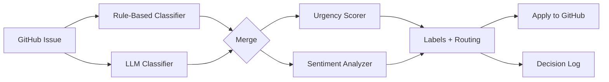

# Issue Sentinel 🛡️

[](https://github.com/kustonaut/issue-sentinel/actions/workflows/ci.yml)
[](https://www.python.org/downloads/)
[](https://opensource.org/licenses/MIT)
[](https://pypi.org/project/issue-sentinel/)

**AI-powered GitHub issue triage. Classify, prioritize, and route issues automatically.**

> Built by a PM who manages 6,000+ GitHub issues and got tired of manual triage.

**[Live Demo](https://kustonaut.github.io/issue-sentinel)** · [PyPI](https://pypi.org/project/issue-sentinel/) · [Contributing](CONTRIBUTING.md)

---

## The Problem

Open-source maintainers and product teams drown in GitHub issues. Every new issue needs:
- **Classification** — Is this a bug, feature request, question, or docs issue?
- **Routing** — Which product area owns this?
- **Urgency scoring** — Is this a regression? A security issue? A P0 blocker?
- **Sentiment read** — Is the reporter frustrated, neutral, or constructive?

Manual triage doesn't scale. Issue Sentinel does.

## Features

| Feature | Description |
|---------|-------------|
| 🏷️ **Auto-Classification** | Rule-based + LLM-powered issue classification by type and product area |
| 🎯 **Urgency Scoring** | Detects regressions, security keywords, and escalation signals |
| 💬 **Sentiment Analysis** | Scores reporter sentiment (frustrated → neutral → positive) |
| 🤖 **LLM Integration** | OpenAI, Anthropic, or local models via configurable providers |
| 🔄 **GitHub Actions** | Drop-in action for real-time triage on new issues |
| 📊 **Accuracy Tracking** | Logs classification decisions for continuous improvement |
| ⚙️ **YAML Config** | Define your own areas, keywords, and routing rules |

## Quick Start

### Installation

```bash
pip install issue-sentinel
```

### Basic Usage

```python
from issue_sentinel import IssueSentinel

sentinel = IssueSentinel.from_config("config.yaml")

# Classify a single issue
result = sentinel.classify(
    title="API returns 500 on login endpoint after upgrade",
    body="After updating to v3, the /auth/login endpoint crashes with a 500..."
)

print(result)
# ClassificationResult(
#   category="bug",
#   area="backend",
#   urgency=0.85,
#   sentiment="frustrated",
#   suggested_labels=["bug", "backend", "regression", "p1"]
# )
```

### CLI

```bash
# Triage a single issue
issue-sentinel classify --repo owner/repo --issue 1234

# Bulk triage all open issues
issue-sentinel triage --repo owner/repo --state open --limit 50

# Dry run (no labels applied)
issue-sentinel triage --repo owner/repo --dry-run
```

### GitHub Action

Drop into any repo — auto-triages every new issue:

```yaml
name: Issue Triage
on:
  issues:
    types: [opened]

permissions:
  issues: write

jobs:
  triage:
    runs-on: ubuntu-latest
    steps:
      - uses: actions/checkout@v4
      - uses: kustonaut/issue-sentinel@v1
        with:
          github-token: ${{ secrets.GITHUB_TOKEN }}
          apply-labels: 'true'
```

#### Action Inputs

| Input | Default | Description |
|-------|---------|-------------|
| `github-token` | `${{ github.token }}` | Token with `issues:write` permission |
| `config` | `.github/issue-sentinel.yaml` | Path to config file (uses defaults if missing) |
| `apply-labels` | `true` | Apply suggested labels to the issue |
| `post-comment` | `false` | Post a triage summary comment |
| `python-version` | `3.12` | Python version for the runner |

> See [`examples/workflow-issue-triage.yml`](examples/workflow-issue-triage.yml) for a ready-to-copy workflow.

## Configuration

```yaml
# issue-sentinel.yaml
areas:
  - name: backend
    keywords: ["api", "server", "database", "auth", "endpoint"]
    owners: ["@backend-team"]
  - name: frontend
    keywords: ["ui", "button", "css", "layout", "react", "component"]
    owners: ["@frontend-team"]
  - name: infra
    keywords: ["deploy", "docker", "ci", "kubernetes", "config"]
    owners: ["@platform-team"]

urgency:
  high_signals: ["regression", "crash", "data loss", "security", "breaking change"]
  escalation_threshold: 0.8

classification:
  provider: "openai"           # openai | anthropic | local
  model: "gpt-4o-mini"         # cost-effective for classification
  fallback: "rule-based"       # if LLM fails, use keyword matching
  temperature: 0.1             # low temp for consistent classification

labels:
  apply: true
  prefix: ""                   # optional prefix like "triage/"
  include_urgency: true        # adds p0/p1/p2/p3 labels
  include_sentiment: false     # optional sentiment labels
```

## Architecture



## How It Works

1. **Rule-Based Pass** — Fast keyword matching against configured areas. Catches ~60% of issues with zero latency and zero cost.
2. **LLM Pass** — For ambiguous issues, sends title + body to an LLM with few-shot examples. Catches the remaining ~35%.
3. **Urgency Scoring** — Scans for regression signals, security keywords, escalation patterns. Outputs a 0-1 urgency score.
4. **Sentiment Analysis** — Lightweight sentiment classification (frustrated/neutral/positive) to prioritize frustrated users.
5. **Action** — Applies labels, assigns to area owners, posts a triage comment. All configurable.
6. **Learning** — Logs all decisions to a JSON file. Track accuracy over time and tune your rules.

## Why This Exists

I built Issue Sentinel because:
- I manage GitHub issue funnels across multiple open-source projects
- Manual triage of 100+ issues/week was consuming entire PM mornings
- Existing tools were either too expensive (paid SaaS) or too complex (required ML training)
- A rules-first + LLM-fallback approach gives 95% accuracy at near-zero cost

This is extracted from a production system that triages real issues daily.

## Requirements

- Python 3.10+
- GitHub token with `issues:write` and `labels:write` permissions
- (Optional) OpenAI or Anthropic API key for LLM classification

## Contributing

Contributions welcome! See [CONTRIBUTING.md](CONTRIBUTING.md) for guidelines.

## License

MIT — see [LICENSE](LICENSE)

---

**Part of the [PM OS](https://github.com/kustonaut) ecosystem** — tools built by a PM who codes.  
Try the [interactive demo →](https://kustonaut.github.io/issue-sentinel)
