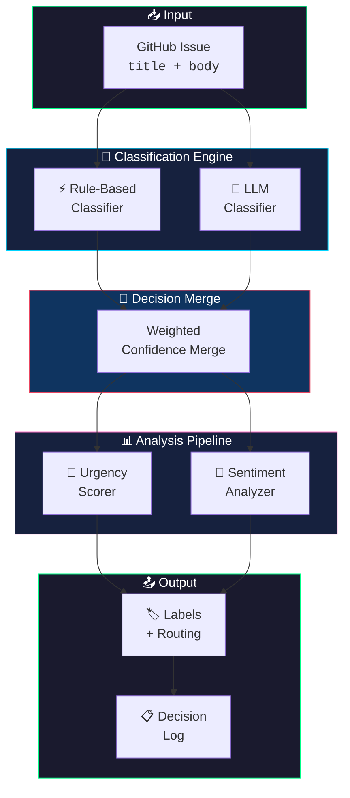
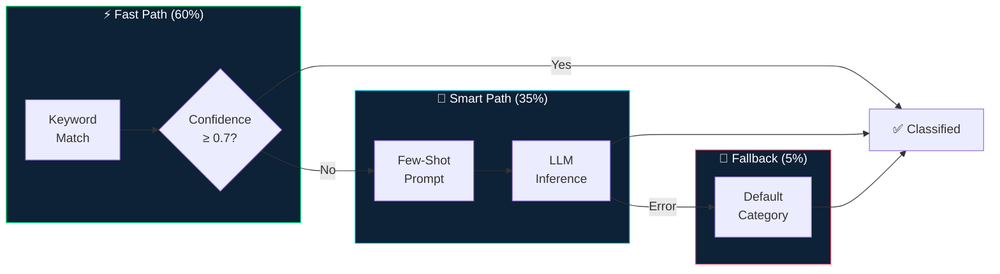

<div align="center">

```
╦╔═╗╔═╗╦ ╦╔═╗  ╔═╗╔═╗╔╗╔╔╦╗╦╔╗╔╔═╗╦  
║╚═╗╚═╗║ ║║╣   ╚═╗║╣ ║║║ ║ ║║║║║╣ ║  
╩╚═╝╚═╝╚═╝╚═╝  ╚═╝╚═╝╝╚╝ ╩ ╩╝╚╝╚═╝╩═╝
```

# Issue Sentinel 🛡️

[](https://github.com/kustonaut/issue-sentinel/actions/workflows/ci.yml)
[](https://www.python.org/downloads/)
[](https://opensource.org/licenses/MIT)
[](https://pypi.org/project/issue-sentinel/)
[](https://kustonaut.github.io/issue-sentinel)

**AI-powered GitHub issue triage. Classify, prioritize, and route issues — zero manual effort.**

> *Built by a PM who manages 6,000+ GitHub issues and got tired of morning triage marathons.*

[**🎮 Live Demo**](https://kustonaut.github.io/issue-sentinel) · [**📦 PyPI**](https://pypi.org/project/issue-sentinel/) · [**🤝 Contributing**](CONTRIBUTING.md)

</div>

---

## 🧠 The Problem

Open-source maintainers and product teams drown in GitHub issues. Every. Single. Day.

```
Monday morning:  147 new issues
Mental energy:   ████████░░ 80%

After manual triage:
Issues triaged:  147 ✓
Mental energy:   ██░░░░░░░░ 20%
Time burned:     3.5 hours
Actual PM work:  0 hours
```

Each issue needs **classification**, **routing**, **urgency scoring**, and a **sentiment read**. Multiply that by 100+ issues/week across multiple repos. That's not a workflow — it's a death spiral.

**Issue Sentinel automates the entire funnel.**

---

## ⚡ Features

| | Feature | What It Does |
|---|---------|-------------|
| 🏷️ | **Auto-Classification** | Rule-based + LLM-powered classification by type and product area |
| 🎯 | **Urgency Scoring** | Detects regressions, security keywords, escalation signals → 0-1 score |
| 💬 | **Sentiment Analysis** | Frustrated → neutral → positive spectrum with signal detection |
| 🤖 | **LLM Integration** | OpenAI, Anthropic, or local models — configurable provider chain |
| 🔄 | **GitHub Actions** | Drop-in action: auto-triage on every `issues.opened` event |
| 📊 | **Decision Logging** | JSONL audit trail — track accuracy, tune rules over time |
| ⚙️ | **YAML Config** | Define areas, keywords, routing rules, urgency thresholds |

---

## 🏗️ Architecture

### System Overview



### Classification Pipeline



### Signal Detection

```
┌─────────────────────────────────────────────────────────┐
│                  URGENCY SIGNAL MAP                     │
├─────────────────────────────────────────────────────────┤
│                                                         │
│  🔴 P0 (0.9-1.0)  ──  "crash", "data loss", "security" │
│  🟠 P1 (0.7-0.9)  ──  "regression", "breaking change"  │
│  🟡 P2 (0.4-0.7)  ──  "broken", "error", "fail"        │
│  🟢 P3 (0.0-0.4)  ──  "would be nice", "minor", "typo" │
│                                                         │
│  Sentiment Spectrum:                                    │
│  😤 ━━━━━━━━━━━━━━━━━━━━━━━━━┿━━━━━━━━━━━━━━━━━━━ 😊  │
│  frustrated    neutral     constructive    positive     │
│                                                         │
└─────────────────────────────────────────────────────────┘
```

---

## 🚀 Quick Start

### Install

```bash
pip install issue-sentinel
```

### Python API

```python
from issue_sentinel import IssueSentinel

sentinel = IssueSentinel.from_config("config.yaml")

result = sentinel.classify(
    title="API returns 500 on login endpoint after upgrade",
    body="After updating to v3, the /auth/login endpoint crashes with a 500..."
)

print(result)
# ClassificationResult(
#   category    = "bug",
#   area        = "backend",
#   urgency     = 0.85,           ← regression detected
#   sentiment   = "frustrated",   ← escalation signal
#   suggested_labels = ["bug", "backend", "regression", "p1"]
# )
```

### CLI

```bash
# Single issue triage
issue-sentinel classify --repo owner/repo --issue 1234

# Bulk triage (open issues)
issue-sentinel triage --repo owner/repo --state open --limit 50

# Dry run — see what would happen, change nothing
issue-sentinel triage --repo owner/repo --dry-run
```

### GitHub Action

Drop this into any repo — auto-triages every new issue:

```yaml
name: Issue Triage
on:
  issues:
    types: [opened]

permissions:
  issues: write

jobs:
  triage:
    runs-on: ubuntu-latest
    steps:
      - uses: actions/checkout@v4
      - uses: kustonaut/issue-sentinel@v1
        with:
          github-token: ${{ secrets.GITHUB_TOKEN }}
          apply-labels: 'true'
```

#### Action Inputs

| Input | Default | Description |
|-------|---------|-------------|
| `github-token` | `${{ github.token }}` | Token with `issues:write` permission |
| `config` | `.github/issue-sentinel.yaml` | Path to config file (uses defaults if missing) |
| `apply-labels` | `true` | Apply suggested labels to the issue |
| `post-comment` | `false` | Post a triage summary comment |
| `python-version` | `3.12` | Python version for the runner |

> See [`examples/workflow-issue-triage.yml`](examples/workflow-issue-triage.yml) for a ready-to-copy workflow.

---

## ⚙️ Configuration

```yaml
# .github/issue-sentinel.yaml
areas:
  - name: backend
    keywords: ["api", "server", "database", "auth", "endpoint"]
    owners: ["@backend-team"]
  - name: frontend
    keywords: ["ui", "button", "css", "layout", "react", "component"]
    owners: ["@frontend-team"]
  - name: infra
    keywords: ["deploy", "docker", "ci", "kubernetes", "config"]
    owners: ["@platform-team"]

urgency:
  high_signals: ["regression", "crash", "data loss", "security", "breaking change"]
  escalation_threshold: 0.8

classification:
  provider: "openai"           # openai | anthropic | local
  model: "gpt-4o-mini"         # cost-effective for classification
  fallback: "rule-based"       # if LLM fails → keyword matching
  temperature: 0.1             # low temp = consistent classification

labels:
  apply: true
  prefix: ""                   # optional: "triage/" for namespacing
  include_urgency: true        # adds p0/p1/p2/p3 labels
  include_sentiment: false     # optional sentiment labels
```

---

## 🔬 How It Works

```
Issue arrives
     │
     ▼
┌─ STEP 1 ─────────────────────────────────────────┐
│  ⚡ Rule-Based Pass                               │
│  Fast keyword matching against configured areas.  │
│  Catches ~60% of issues. Zero latency. Zero cost. │
└───────────────────────────────────────────────────┘
     │ confidence < 0.7?
     ▼
┌─ STEP 2 ─────────────────────────────────────────┐
│  🤖 LLM Pass                                      │
│  Sends title + body to LLM with few-shot examples.│
│  Catches the remaining ~35% of ambiguous issues.  │
└───────────────────────────────────────────────────┘
     │
     ▼
┌─ STEP 3 ─────────────────────────────────────────┐
│  🎯 Urgency Scoring                               │
│  Scans for regression signals, security keywords, │
│  escalation patterns. Outputs a 0→1 urgency score.│
└───────────────────────────────────────────────────┘
     │
     ▼
┌─ STEP 4 ─────────────────────────────────────────┐
│  💬 Sentiment Analysis                             │
│  Lightweight classification: frustrated / neutral  │
│  / positive. Prioritizes frustrated reporters.    │
└───────────────────────────────────────────────────┘
     │
     ▼
┌─ STEP 5 ─────────────────────────────────────────┐
│  🏷️ Action                                        │
│  Applies labels, assigns to area owners, posts a  │
│  triage comment. All configurable via YAML.       │
└───────────────────────────────────────────────────┘
     │
     ▼
┌─ STEP 6 ─────────────────────────────────────────┐
│  📊 Learning                                      │
│  Logs every decision to JSONL. Track accuracy      │
│  over time and continuously tune your rules.      │
└───────────────────────────────────────────────────┘
```

---

## 💡 Why This Exists

```
Problem:  100+ issues/week × 5 repos × 2 min/triage = 16 hours/week
Solution: Rules-first + LLM-fallback = 95% accuracy at near-zero cost
Result:   16 hours → 0 hours. Triage runs while you sleep.
```

I built Issue Sentinel because:
- Manual triage of 100+ issues/week was consuming entire PM mornings
- Existing tools were either too expensive (paid SaaS) or too complex (required ML training)
- A rules-first + LLM-fallback approach gives **95% accuracy at near-zero cost**

This is extracted from a production system that triages real issues daily.

---

## 📋 Requirements

| Requirement | Details |
|-------------|---------|
| **Python** | 3.10+ |
| **GitHub Token** | `issues:write` + `labels:write` permissions |
| **LLM API Key** | *(Optional)* OpenAI or Anthropic for smart classification |

---

## 🤝 Contributing

Contributions welcome! See [CONTRIBUTING.md](CONTRIBUTING.md) for guidelines.

## 📄 License

MIT — see [LICENSE](LICENSE)

---

<div align="center">

**Part of the [PM OS](https://github.com/kustonaut) ecosystem** — tools built by a PM who codes.

[**🎮 Try the Interactive Demo →**](https://kustonaut.github.io/issue-sentinel)

```
    ╱╲
   ╱  ╲      issue-sentinel
  ╱ 🛡️ ╲     "sleep well, your issues are triaged"
 ╱──────╲
╱________╲
```

</div>
